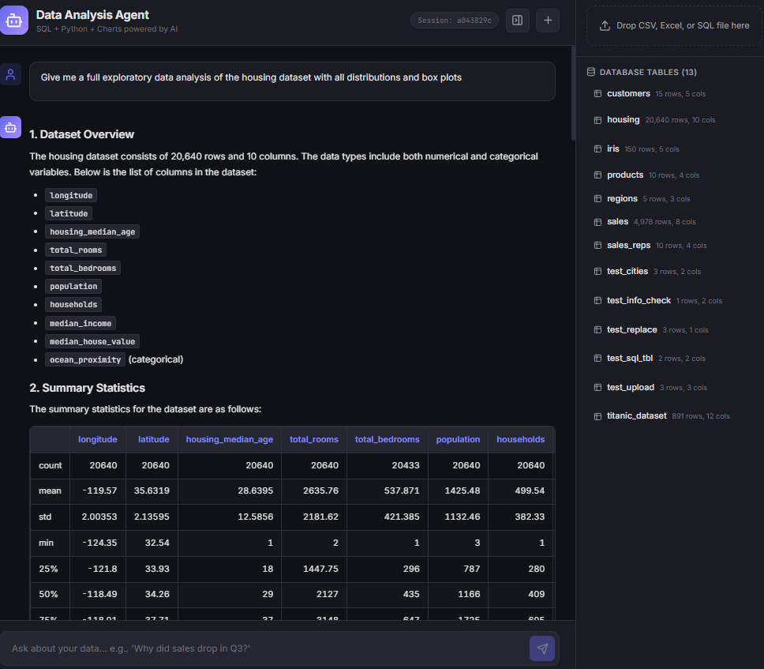
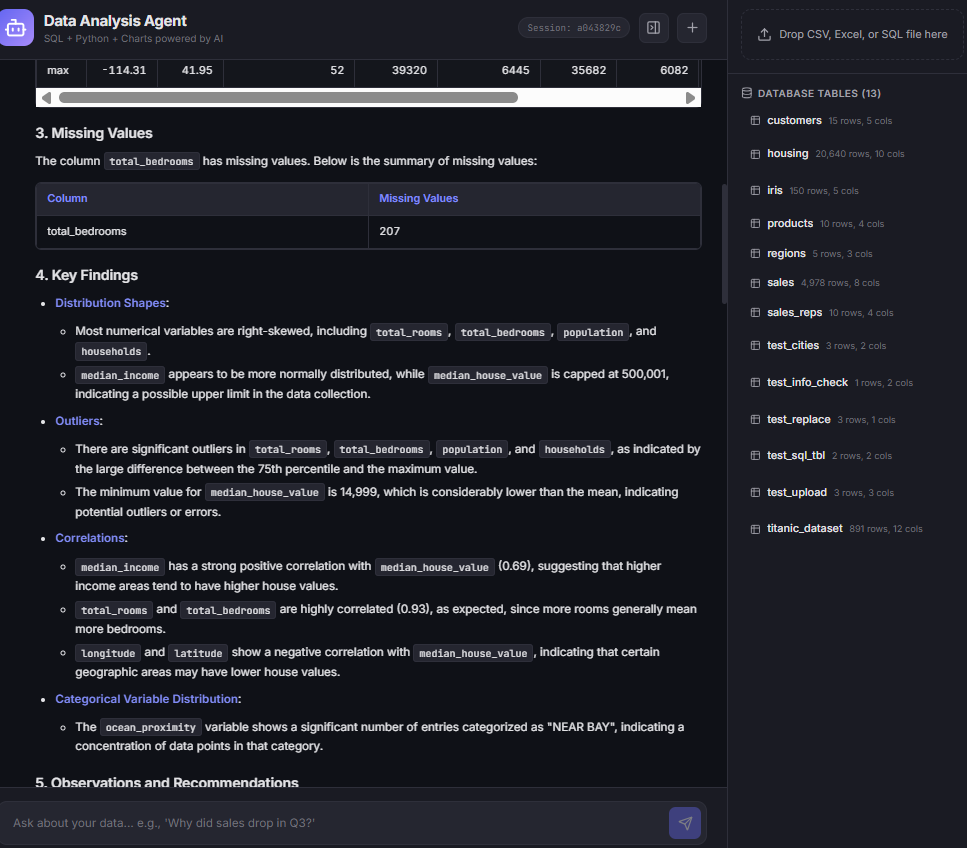
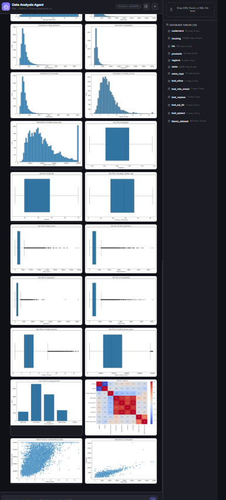
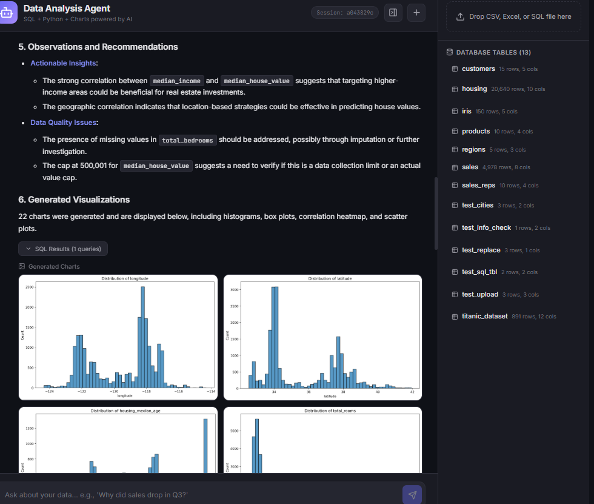

# Data Analysis Agent

A multi-agent AI system that acts as your personal data analyst. Upload any dataset, ask questions in natural language — it writes SQL queries, executes Python analysis, generates charts, and explains insights.

Built with **LangGraph** (multi-agent orchestration), **FastAPI** (backend), and **React** (frontend).

## Demo

> *"Give me a full exploratory data analysis of the housing dataset with all distributions and box plots"*

**Structured report with statistics, tables, and key findings:**

<p align="center">
  
</p>

**Distribution analysis, correlations, and actionable insights:**

<p align="center">
  
</p>

**22 auto-generated charts — histograms, box plots, heatmap, scatter plots:**

<p align="center">
  
</p>

**Observations, recommendations, and data quality notes:**

<p align="center">
  
</p>

## How It Works

```
User: "Why did sales drop in Q3 2024?"
                    │
                    ▼
           ┌─── Planner Agent ───┐
           │  Analyzes question   │
           │  Retrieves schema    │
           │  Creates plan        │
           └──────────┬───────────┘
                      ▼
           ┌─── SQL Agent ───────┐
           │  Writes & executes  │
           │  SQL queries        │
           └──────────┬──────────┘
                      ▼
           ┌─── Python Agent ────┐
           │  pandas/numpy       │
           │  analysis & plots   │
           └──────────┬──────────┘
                      ▼
           ┌─── Chart Agent ─────┐
           │  matplotlib/seaborn │
           │  visualizations     │
           └──────────┬──────────┘
                      ▼
           ┌─── Insight Agent ───┐
           │  Synthesizes report │
           │  with findings      │
           └─────────────────────┘
```

## Features

- **Multi-Agent Pipeline** — 5 specialized agents orchestrated with LangGraph
- **Upload Any Dataset** — CSV, Excel, TSV, or SQL files loaded into the database on the fly
- **Dataset-Agnostic** — works with any tabular data (Iris, Titanic, California Housing, your own data)
- **Smart Table Detection** — automatically targets the right dataset based on your question
- **SQL Generation & Execution** — safe, read-only SQL with dangerous query blocking
- **Python Analysis** — pandas, numpy, scipy in a sandboxed environment with safe imports
- **Comprehensive EDA** — generates histograms, box plots, heatmaps, scatter plots for every column
- **Large Dataset Support** — handles 20k+ rows efficiently with automatic optimizations
- **Response Caching** — identical questions return instantly without burning LLM tokens
- **Rate Limit Handling** — automatic retry with exponential backoff on API rate limits
- **Vector Store Context** — ChromaDB indexes schema + domain knowledge for smarter planning
- **Per-User Sessions** — conversation history and artifacts tracked per session
- **Real-Time Progress** — WebSocket streaming with step-by-step progress updates
- **Modern UI** — dark-themed React chat interface with chart display, SQL viewer, file upload, and markdown tables

## Tech Stack

| Layer | Technology |
|-------|-----------|
| LLM | OpenAI GPT-4o (configurable) |
| Orchestration | LangGraph |
| Framework | LangChain |
| Backend | FastAPI + WebSocket |
| Frontend | React + Vite |
| Database | SQLite + SQLAlchemy |
| Vector Store | ChromaDB |
| Charts | Matplotlib + Seaborn |
| Analysis | Pandas + NumPy |

## Quick Start

### Prerequisites

- Python 3.11+
- Node.js 18+
- OpenAI API key

### Setup

```bash
# Clone the repo
git clone https://github.com/alirezasaberi20/data-analysis-agent.git
cd data-analysis-agent

# Install Python dependencies
pip install -r requirements.txt

# Set your API key
cp .env.example .env
# Edit .env and add your OPENAI_API_KEY

# Install frontend dependencies
cd frontend && npm install && cd ..
```

### Run

**Terminal 1 — Backend:**
```bash
python run.py
```

**Terminal 2 — Frontend:**
```bash
cd frontend
npm run dev
```

Open **http://localhost:3000**

## Usage

### Built-in Sample Data

The app comes with a pre-seeded sales database (2 years of data across products, regions, sales reps, and customers) with a deliberate Q3 2024 revenue dip for analysis.

### Upload Your Own Data

The data panel is open by default on the right side. Drag-and-drop or browse for:

- **CSV / TSV** — loaded as a new database table
- **Excel** (.xlsx) — each sheet becomes a separate table
- **SQL** — raw SQL statements executed directly

The vector store re-indexes automatically so agents immediately know about your new tables.

### Example Questions

**Exploratory Analysis:**
- "Give me a full EDA of the iris dataset"
- "Show the distribution of all features"
- "What is the correlation matrix?"

**Business Intelligence:**
- "Why did sales drop in Q3 2024?"
- "Which product has the highest revenue?"
- "Compare regional performance across 2024"

**Visualization:**
- "Plot petal length vs sepal length colored by species"
- "Show monthly sales trend with a bar chart"
- "Create a heatmap of sales by product and region"

**Deep Analysis:**
- "What's the discount impact on revenue?"
- "Find the top 5 product-region combinations"
- "Are there any outliers in the dataset?"

## Project Structure

```
├── backend/
│   ├── main.py                  # FastAPI app (REST + WebSocket)
│   ├── config.py                # Environment configuration
│   ├── cache.py                 # Response caching with schema-aware invalidation
│   ├── agents/
│   │   ├── orchestrator.py      # LangGraph state machine
│   │   └── nodes.py             # 5 agent nodes (planner, sql, python, chart, insight)
│   ├── tools/
│   │   ├── sql_tool.py          # SQL executor (read-only, safe)
│   │   ├── python_tool.py       # Sandboxed Python executor with safe imports & plot support
│   │   └── chart_tool.py        # JSON-spec chart generator
│   ├── database/
│   │   ├── connection.py        # SQLAlchemy engine + file upload handlers
│   │   └── sample_data.py       # Sample sales data seeder
│   ├── vector_store/
│   │   └── store.py             # ChromaDB schema + domain knowledge indexer
│   └── sessions/
│       └── manager.py           # Per-user session management
├── frontend/
│   └── src/
│       ├── App.jsx              # Main chat interface
│       ├── components/
│       │   ├── ChatMessage.jsx  # Markdown (GFM tables) + charts + SQL display
│       │   ├── StepIndicator.jsx
│       │   ├── FileUpload.jsx   # Drag-and-drop file upload
│       │   └── TablesPanel.jsx  # Database tables viewer
│       └── styles.css           # Dark theme UI
├── tests/                       # 50 tests covering all layers
├── docs/screenshots/            # Demo screenshots
├── run.py                       # One-command server launch
├── requirements.txt
└── .env
```

## API Endpoints

| Method | Endpoint | Description |
|--------|----------|-------------|
| `GET` | `/health` | Health check |
| `POST` | `/api/chat` | Send a message and get analysis |
| `WS` | `/ws/chat` | WebSocket for streaming responses |
| `POST` | `/api/upload` | Upload CSV/Excel/SQL file |
| `GET` | `/api/tables` | List all database tables |
| `DELETE` | `/api/tables/{name}` | Delete a table |
| `GET` | `/api/sessions` | List active sessions |
| `GET` | `/api/sessions/{id}/history` | Get session history |
| `DELETE` | `/api/sessions/{id}` | Delete a session |
| `GET` | `/api/cache/stats` | Cache statistics |
| `DELETE` | `/api/cache` | Clear response cache |

## License

MIT
